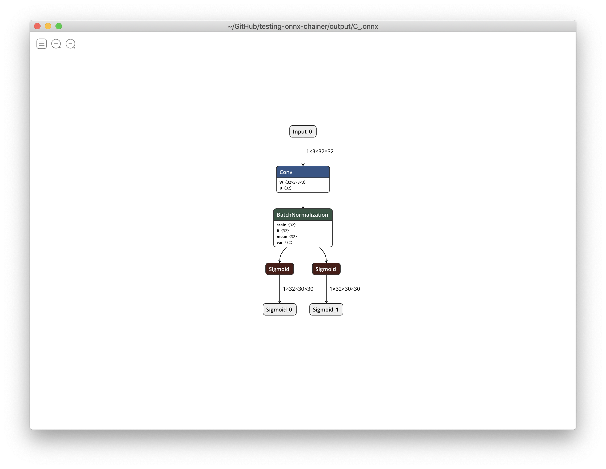
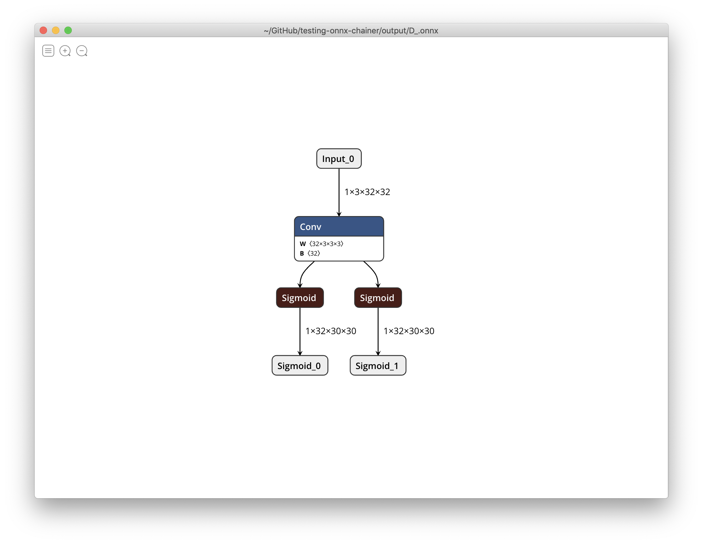

# testing-onnx-chainer

fixed in onnx-chainer@v1.3.2 :tada:

```bash
$ docker-compose run fixed python test_multi_outputs_fixed.py
```

output/C_.onnx



output/D_.onnx



---

old

```bash
$ docker-compose run dev python test_multi_outputs.py
```

output/A.onnx


output/B.onnx


output/C.onnx


output/D.onnx


